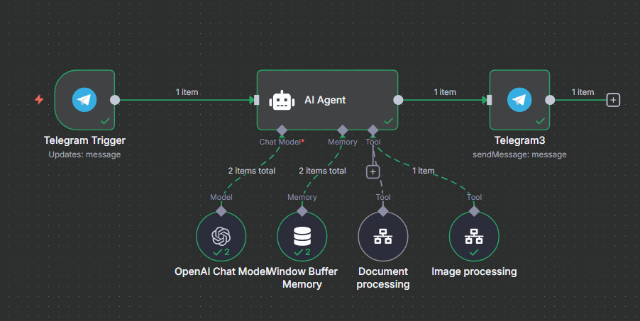
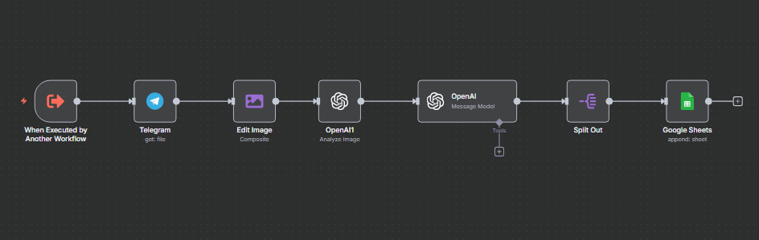
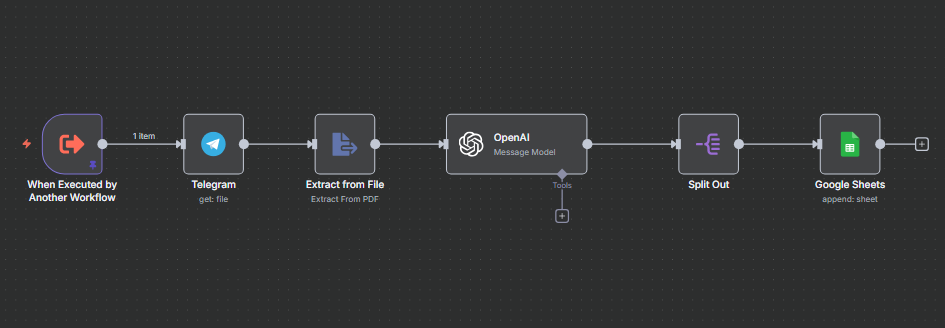
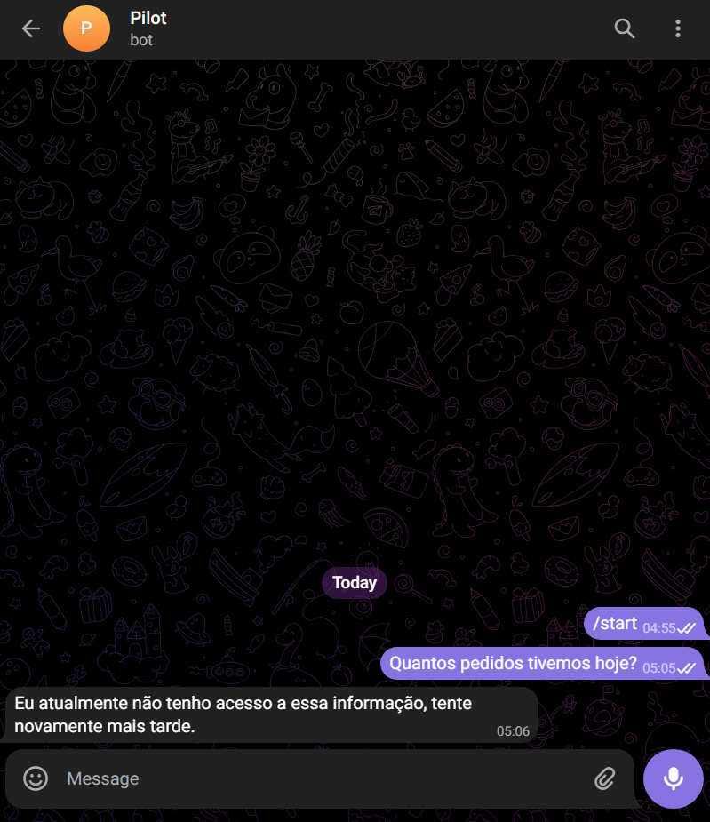
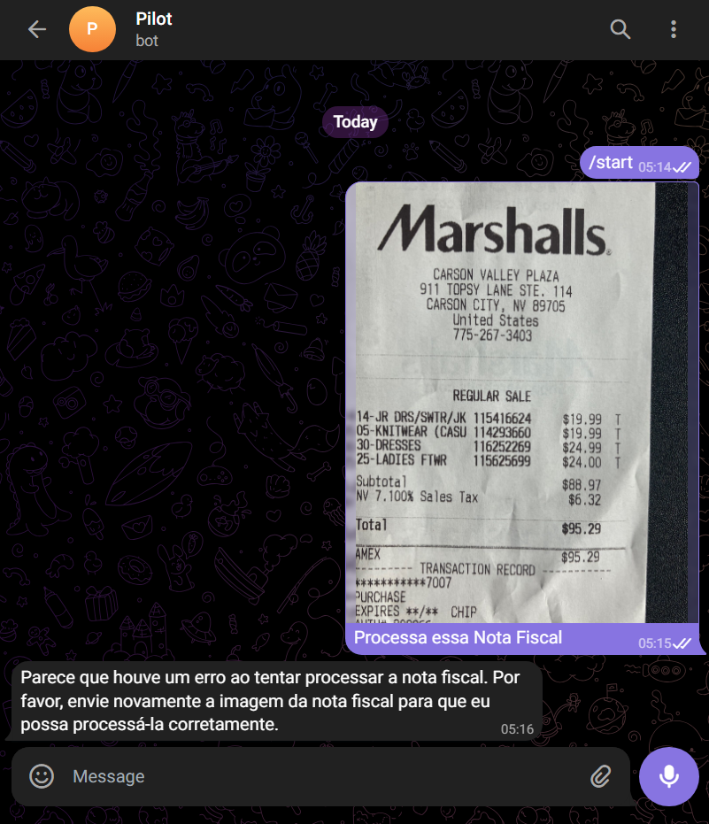

# Piloto Bot: Your Conversational AI Assistant

This document outlines the vision, architecture, and development roadmap for the **Piloto Bot**, an intelligent assistant designed to be the primary data input interface for the AI-powered ERP.

## The Problem: Operational Overload in Restaurant Management

Restaurant owners are often overwhelmed by the complexity of traditional management software. The need for manual data entry across clunky interfaces—from logging invoices to updating inventory—is time-consuming, prone to errors, and distracts from strategic decision-making. This "operational overload" keeps them stuck in day-to-day fire-fighting rather than focusing on growth.

## The Solution: A Unified, Conversational Interface

The Piloto Bot transforms restaurant management by replacing tedious data entry with simple, natural language conversation. It serves two distinct but integrated roles in the ecosystem:

1.  **The Bot as the Input Interface**: The owner's primary interaction for recording operational data will be through a chat interface (like Telegram or WhatsApp). Instead of navigating complex menus, they can simply send a message, a photo of an invoice, or a document. The AI is responsible for understanding, parsing, and logging this information automatically. The owner can also proctor business health and data through the conversation.

2.  **The Web App as the Dashboard**: While the bot handles input, the **Next.js frontend** serves as the central dashboard for analytics and visualization. All data captured by the bot is processed by the **FastAPI backend** and reflected in real-time on the web interface. This allows the owner to monitor key metrics, view sales trends, and get a clear overview of their business health without ever having to perform manual data entry there.

This separation of concerns is the core of our solution: **Converse to input, view to analyze.**

*High-level workflow: The user interacts with the bot, which sends structured data to the backend. The frontend consumes this data to populate dashboards.*

## Core Features & Workflow

### 1. Invoice and Expense Management

This is the cornerstone of the bot's utility. The workflow is designed for maximum simplicity:

1.  **User Action**: The restaurant owner receives an invoice from a supplier and takes a picture of it or receives a PDF.
2.  **Input**: They forward the image or document directly to the Piloto Bot.
3.  **AI Processing**: The bot's AI agent (currently prototyped in n8n) receives the file. It uses optical character recognition (OCR) and a large language model to parse key details:
    *   Supplier Name
    *   Date
    *   List of items purchased (e.g., "Tomatoes," "Onions," "Chicken Breast")
    *   Quantities and units (e.g., 10 kg, 5 boxes)
    *   Total cost
4.  **Backend Integration**: The structured data is sent to a dedicated endpoint on the **FastAPI backend**.
5.  **Database Update**: The backend logic then:
    *   Updates the `inventory_items` table with the new stock levels.
    *   Records the transaction in the `expenses` table.
6.  **User Confirmation**: The bot sends a confirmation message to the user, such as: "Got it. I've updated the inventory with items from the invoice and recorded an expense of R$ 250,00."
7.  **Dashboard Visualization**: The updated inventory levels and expense records are immediately visible on the **web dashboard**.

*The n8n subworkflow that processes images, structures the output, and stores it in the database.*

*The n8n subworkflow that processes documents, structures the output, and stores it in the database.*

### 2. Real-time Inventory Queries

While the web dashboard provides a full overview, the bot can answer quick questions on the go.

-   **User**: "How many kilos of tomatoes do we have left?"
-   **Bot (via Backend)**: "We have 12.5 kg of tomatoes in stock."

## Development Roadmap: From Prototype to Integrated System

### Current State: Proof of Concept

The bot currently functions as a standalone proof of concept using n8n for workflow automation and ChatGPT for conversation. The bot is able to respond user requests with business data, also preventing itself from generating hallucinations.

#### Providing Business information:

This is the current state of the read only features.

*Successful response of known business data, given beforehand.*

 The future plan is to integrate it with the backend app and the database as to use accurate numbers and prevent hallucinations and storing all processed information sent by the user. From a quick prompt engineering we were already able to guard the bot from generating non existent numbers

*The PoC is also capable of handling hallucinations.*

#### Processing Business documents/images:

It can also successfully parse images and documents, but it is not yet connected to the production backend. This stage has been crucial for validating the core AI parsing capabilities.

<video controls src="assets/bot_use_tests/Bot-image-processing.mp4" title="Title"></video>
*Successful parsing of a "Nota Fiscal" during the PoC phase.*

*The PoC is also capable of communicating errors during processing.*

### Next Steps: Full Integration

The next sprint is focused on fully integrating the bot into our application ecosystem.

1.  **API Endpoint Development**: Create the necessary endpoints in the FastAPI backend to receive structured data from the bot for inventory updates and expense recording.
2.  **Connect Bot to Backend**: Replace the n8n database-writing steps with API calls to our new backend endpoints. This will officially link the conversational interface with our central database.
3.  **Refine AI Prompting**: Evolve the AI's system prompt from a "read-only analyst" to an "action-oriented assistant" that understands its role is to capture data and trigger backend actions.
4.  **Frontend Validation**: Ensure the `dashboard-view.tsx` and related components on the frontend correctly display the data being fed into the system by the bot.

By achieving this, we will deliver on the core user story: allowing a manager to update their entire inventory and expense log simply by forwarding an invoice, thus turning operational overload into strategic clarity.