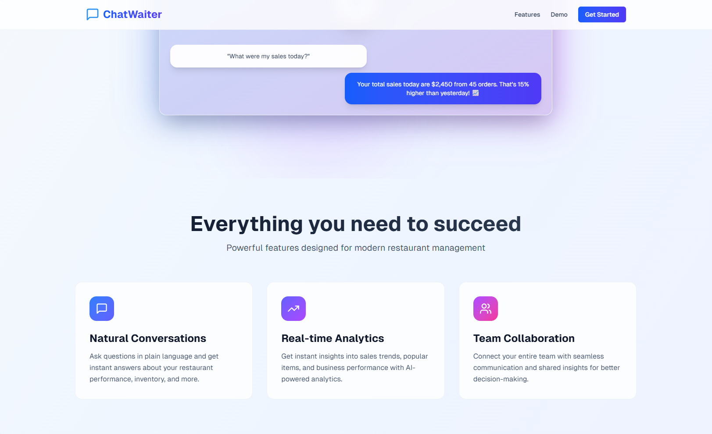

# Landing Page Documentation

## Overview
The ChatWaiter landing page serves as the primary entry point for potential users, introducing them to the AI-powered restaurant management assistant. The page is designed to communicate the core value proposition clearly and quickly to busy restaurant owners and managers.

## Hero Section

### Message
**"Chat with your restaurant data"**

The hero section emphasizes the conversational nature of the platform, making complex restaurant management as simple as having a chat. The tagline "Transform how you manage your restaurant with AI-powered conversations" directly addresses the user's pain point: frustration with complicated legacy systems.

### Key Elements
- **Badge:** "AI-Powered Restaurant Assistant" establishes credibility and technology focus
- **Headline:** Clear, benefit-driven message focusing on natural interaction
- **Subheadline:** Explains the transformation promise - getting insights, managing orders, and streamlining operations through natural chat
- **CTAs:** "Start Free Trial" (primary) and "Watch Demo" (secondary) provide clear next steps

### Interactive Demo Chat
The hero section includes a sample chat interaction demonstrating the AI's capabilities:
- **User Query:** "What were my sales today?"
- **AI Response:** Provides specific, actionable data with context (total sales, number of orders, percentage comparison to previous day)

This live example immediately shows the value and simplicity of the conversational interface.

## Features Section

### Headline
**"Everything you need to succeed"**
**"Powerful features designed for modern restaurant management"**

### Feature Cards

#### 1. Natural Conversations (Blue icon)
**Icon:** Chat bubble
**Description:** "Ask questions in plain language and get instant answers about your restaurant performance, inventory, and more."
**Value Prop:** Eliminates the need for complex navigation or training - just ask naturally.

#### 2. Real-time Analytics (Purple icon)
**Icon:** Trending chart
**Description:** "Get instant insights into sales trends, popular items, and business performance with AI-powered analytics."
**Value Prop:** Immediate access to business intelligence without manual report generation.

#### 3. Team Collaboration (Pink icon)
**Icon:** Users/people
**Description:** "Connect your entire team with seamless communication and shared insights for better decision-making."
**Value Prop:** Breaks down information silos and enables data-driven teamwork.

## Future Enhancement: Embedded Video

### Planned Video Content
The landing page is designed to include an embedded demonstration video that will showcase real user interaction with the ChatWaiter chat interface. This video will be positioned prominently in the hero section or immediately after it.

### Video Intent & Content
The video will demonstrate:

1. **Opening Scene:** A restaurant owner/manager in their natural work environment
2. **Natural Interaction:** Show the user asking questions via chat:
   - "How did we perform yesterday?"
   - "What are my best-selling items this week?"
   - "Show me inventory items running low"
3. **AI Responses:** Display the conversational, helpful responses with data visualizations
4. **Action Taken:** Show how insights lead to immediate decisions (e.g., ordering more inventory, adjusting menu items)
5. **Multi-channel Access:** Briefly show the same conversation on mobile/Telegram

### Video Purpose
- **Reduce Friction:** Help potential users visualize themselves using the product
- **Build Trust:** Show real interactions, not just marketing claims
- **Demonstrate Simplicity:** Prove that anyone can use it without technical expertise
- **Highlight Speed:** Show how quick answers are compared to traditional systems

### Technical Specifications (Planned)
- **Duration:** 45-60 seconds
- **Format:** MP4, embedded with autoplay (muted) on desktop
- **Fallback:** Animated GIF or static screenshots for slower connections
- **Placement:** Center of hero section, replacing or augmenting the static chat example
- **Controls:** Play/pause, sound toggle, full-screen option

## Design Philosophy

### Color Psychology
- **Blue (primary):** Trust, professionalism, reliability
- **Purple:** Innovation, AI/technology association
- **Pink:** Approachability, human-centric design
- **Light gradient background:** Modern, clean, uncluttered

### Messaging Strategy
The landing page messaging focuses on:
1. **Simplicity over complexity:** "Chat" vs "navigate through menus"
2. **Speed over manual work:** "Instant insights" vs "generate reports"
3. **Empowerment:** "Transform how you manage" suggests user control
4. **Accessibility:** "Plain language" emphasizes no technical barrier

### Target Audience Alignment
The page directly addresses the primary user persona (owner/manager) by:
- Using restaurant-specific terminology (sales, inventory, orders)
- Showing practical, real-world questions they actually ask
- Focusing on business outcomes (profitability, efficiency)
- Avoiding technical jargon or implementation details

## Conversion Goals
1. **Primary:** Drive "Start Free Trial" sign-ups
2. **Secondary:** Engage users with "Watch Demo" to reduce uncertainty
3. **Tertiary:** Build brand awareness and position ChatWaiter as a modern alternative to legacy systems
